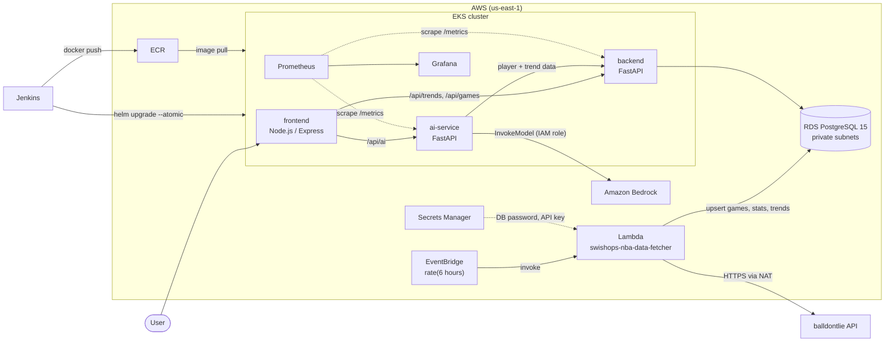

# 🏀 SwishOps


SwishOps is an NBA fantasy-basketball insights platform on AWS. A scheduled Lambda ingests games and player box scores into PostgreSQL and computes per-player trends. A FastAPI backend serves that data, a FastAPI AI service turns it into START / SIT / WATCH recommendations and weekly picks with Amazon Bedrock, and a Node.js dashboard puts it in front of the user. Infrastructure is Terraform, workloads run on EKS via Helm, and a Jenkins pipeline gates each release on SonarQube, pytest and Trivy.

The stack is built to be stood up on demand, verified end to end, and torn down with `terraform destroy`.

---

## Architecture



**Data flow**

1. EventBridge invokes the Lambda every 6 hours (`rate(6 hours)`, `terraform/modules/lambda/variables.tf`).
2. The Lambda reads its DB password and NBA API key from Secrets Manager, pulls today's games and player stats from the balldontlie API, writes them to RDS, and recalculates every player's trend.
3. The backend serves trends, player detail and today's games from RDS.
4. The AI service fetches player and trend data from the backend and asks Bedrock for a recommendation.
5. The frontend serves the dashboard and proxies browser calls to the backend and AI service.

---

## Highlights

### Lambda ingestion pipeline (`lambda/lambda_function.py`)

- **Per-game stats:** fetches today's games (UTC date), then each game's box score using balldontlie's cursor pagination (`per_page=100`).
- **Rolling averages:** for every player, computes season and last-5-game averages for points, rebounds and assists, plus average minutes.
- **Trend flags:** `trend_magnitude` is the % difference between last-5 and season scoring average. `≥ +10%` → `UP`, `≤ −10%` → `DOWN`, otherwise `STABLE`.
- **Rest / injury risk flag:** `rest_flag` is set when last-game minutes fall below 70% of the player's average.
- **Idempotent upserts:** every write is `INSERT … ON CONFLICT DO UPDATE` keyed on `game_id`, `(player_id, game_id)` and `player_id`, so repeated runs on the same day update scores rather than duplicate rows.
- **Self-provisioning schema:** `nba_games`, `player_stats` and `player_trends` are created with `CREATE TABLE IF NOT EXISTS`.
- **Transactional:** one commit per run, with rollback on any database error. Returns `502` if the NBA API fails and `500` on a DB error.

### Bedrock AI integration (`ai-service/main.py`)

- **`POST /api/ai/recommend`:** pulls the player's trend row and last 10 games from the backend and asks the model for a **START / SIT / WATCH** verdict, a 2–3 sentence stat-based rationale and the key risk to monitor.
- **`POST /api/ai/weekly-picks`:** sends the top 10 trend risers and asks for a ranked list of weekly picks, flagging rest and minutes risk.
- **Grounded prompting:** the system prompt instructs the model to base every recommendation strictly on the supplied stats.
- **No API keys:** calls go through `boto3` `bedrock-runtime` using the IAM role's credentials.
- **Defensive handling:** the blocking boto3 call runs in a worker thread (`asyncio.to_thread`). The service detects `refusal` stop reasons, logs `max_tokens` truncation, and returns only text blocks. Failures map to `502` (model), `503` (backend unreachable) or `404` (unknown player).
- **Configurable:** `BEDROCK_MODEL_ID` and `BEDROCK_MAX_TOKENS` (default 4096). Token usage is logged per call.

### Terraform structure (`terraform/`)

**Remote state bootstrap (`terraform/bootstrap`).** Creates the backend that the main configuration uses:

- S3 bucket `swishops-terraform-state`, with versioning, AES256 server-side encryption and `prevent_destroy`.
- DynamoDB table `swishops-terraform-lock` (`PAY_PER_REQUEST`, `LockID` hash key) for state locking.

The root module's `backend "s3"` block stores state at `prod/terraform.tfstate` with `encrypt = true`.

**Modules (`terraform/modules`)**

| Module | What it creates |
|---|---|
| `networking` | VPC, 2 public + 2 private subnets across 2 AZs, internet gateway, one NAT gateway per AZ, security groups for ALB / EKS / nodes / RDS |
| `iam` | EKS cluster role, node group role (EKS worker, CNI, ECR read-only, Bedrock), Lambda role with a scoped Secrets Manager policy |
| `ecr` | `frontend`, `backend`, `ai-service` repositories with scan on push |
| `eks` | EKS cluster and managed node group in private subnets (`t3.medium`, desired 2 / min 1 / max 3) |
| `rds` | PostgreSQL 15.3 on `db.t3.micro`, private subnets, not publicly accessible |
| `secrets` | Secrets Manager entries for the DB password and NBA API key |
| `lambda` | Lambda function (Python 3.11, packaged from `lambda/`), EventBridge schedule and invoke permission |

### Design notes

- **Fault-tolerant database layer:** The backend uses an on-demand, lock-guarded psycopg2 connection pool. It has no hard startup dependency on the database, so pods come up and pass health checks even if RDS is briefly unavailable. During a DB outage, endpoints degrade gracefully with `503` responses rather than crashing, and the pool recovers automatically once the database is reachable again.
- **Helm charts:** one chart per service with liveness and readiness probes on `/health`, resource requests and limits, and a CPU-based HorizontalPodAutoscaler.

---

## Tech stack

| Layer | Technology |
|---|---|
| Cloud | AWS: EKS, EC2, RDS PostgreSQL, Lambda, EventBridge, ECR, Secrets Manager, Bedrock, VPC / NAT, S3 + DynamoDB (Terraform state) |
| Infrastructure as code | Terraform (AWS provider 5.31.0), modular layout |
| Containers & orchestration | Docker, Kubernetes (EKS), Helm 3, HPA |
| CI/CD & code quality | Jenkins, SonarQube, Trivy, pytest |
| Ingestion | Python 3.11 Lambda, `requests`, `psycopg2` |
| Backend | Python 3.11, FastAPI, `psycopg2` connection pool |
| AI service | Python 3.11, FastAPI, `boto3` (Bedrock Runtime), `httpx` |
| Frontend | Node.js 20, Express 4, `axios`, static HTML dashboard |
| Observability | kube-prometheus-stack (Prometheus, Grafana, Alertmanager), `prometheus-fastapi-instrumentator` |

---

## API endpoints

### Backend (FastAPI, container port 8000)

| Method | Path | Description |
|---|---|---|
| GET | `/health` | Liveness / readiness: `{"status": "healthy", "environment": ...}` |
| GET | `/metrics` | Prometheus metrics |
| GET | `/api/trends/up` | Players trending `UP`, sorted by `trend_magnitude` descending |
| GET | `/api/trends/down` | Players trending `DOWN`, sorted by `trend_magnitude` ascending |
| GET | `/api/trends/risers` | Top 10 players by `trend_magnitude` |
| GET | `/api/players/{player_id}` | Player trend row plus last 10 games; `404` if unknown |
| GET | `/api/games/today` | Games for the current UTC date |
| GET | `/api/nba/stats` | Placeholder with a static response |

Database connection failures return `503`.

### AI service (FastAPI, container port 5000)

| Method | Path | Body | Description |
|---|---|---|---|
| GET | `/health` | – | `{"status": "healthy", "model": ...}` |
| GET | `/metrics` | – | Prometheus metrics |
| POST | `/api/ai/recommend` | `{"player_id": 123, "position": "PG"}` (`position` optional) | START / SIT / WATCH recommendation. Returns `player`, `recommendation`, `stats_used` |
| POST | `/api/ai/weekly-picks` | – | Ranked weekly picks from the top 10 risers. Returns `week`, `picks`, `players_analyzed` |
| POST | `/api/ai/predict` | any JSON | Placeholder with a static response |

### Frontend (Express, container port 3000)

| Method | Path | Description |
|---|---|---|
| GET | `/` | Dashboard (`frontend/views/dashboard.html`) |
| GET | `/health` | Liveness / readiness |
| GET | `/api/trends` | Combines backend `/api/trends/up` and `/api/trends/down` |
| GET | `/api/games` | Proxies backend `/api/games/today` |
| POST | `/api/ai` | `{"type": "recommend" \| "weekly-picks", ...}`, proxied to the AI service (60 s timeout) |

Unreachable upstreams and upstream 5xx errors return `503`. Upstream 4xx errors are passed through.

---

## CI/CD

The pipeline is defined in `jenkins/Jenkinsfile`. Stages run in this order:

| # | Stage | What it does |
|---|---|---|
| 1 | Checkout Code | `checkout scm` |
| 2 | SonarQube Static Analysis | `sonar-scanner` (excludes `tests/` and `charts/`), then `waitForQualityGate abortPipeline: true` with a 10-minute timeout |
| 3 | Run Unit Tests | Creates a venv, installs `tests/requirements.txt`, runs `pytest tests/ -v` |
| 4 | Build Docker Images | Builds backend, ai-service and frontend images tagged with the Jenkins `BUILD_NUMBER` |
| 5 | Trivy Security Scan | `trivy image --exit-code 1 --severity HIGH,CRITICAL` on all three images; fails the build on findings |
| 6 | Push to AWS ECR | ECR login with the AWS CLI, then pushes all three images |
| 7 | Deploy to EKS via Helm | `aws eks update-kubeconfig`, then `helm upgrade --install --atomic` for each chart with the new image tag |
| 8 | Deploy Monitoring Stack | Reads the Grafana admin password from Secrets Manager (`swishops/grafana`), creates the `monitoring` namespace and `grafana-admin-credentials` secret, then installs `kube-prometheus-stack` with `monitoring/values.yaml` |

Images are pushed only after they pass the quality gate, the tests and the Trivy scan. `--atomic` rolls a Helm release back automatically if the upgrade fails.

---

## Security practices

- **Scoped IAM for the Lambda:** its custom policy allows only `secretsmanager:GetSecretValue`, and only on the two secret ARNs it reads. Everything else uses AWS-managed service policies (EKS, CNI, ECR read-only, Lambda basic and VPC execution).
- **Secrets Manager:** Terraform stores the DB password and NBA API key in Secrets Manager, and the Lambda reads them at runtime. Jenkins pulls the Grafana admin password from Secrets Manager into a Kubernetes secret. The Terraform inputs are marked `sensitive`, and `terraform.tfvars` is gitignored.
- **No API keys for Bedrock:** the AI service authenticates to Bedrock with IAM role credentials through the default boto3 credential chain.
- **Non-root containers:** the backend and ai-service images run as a dedicated system user (`appuser`), and the frontend runs as the built-in `node` user.
- **Private database:** RDS sits in private subnets with `publicly_accessible = false`. Its security group only admits port 5432 from the nodes / Lambda security group.
- **Encrypted, locked remote state:** S3 state bucket with SSE (AES256), versioning and `prevent_destroy`. The backend uses `encrypt = true` and DynamoDB locking.
- **Supply-chain checks:** a SonarQube quality gate and a Trivy HIGH/CRITICAL gate in CI, plus ECR scan on push.
- **No hardcoded account data in CI:** `AWS_ACCOUNT_ID` is injected as a Jenkins environment variable, and AWS access comes from the Jenkins credentials store.

---

## Observability

- **Prometheus + Grafana + Alertmanager** via `kube-prometheus-stack`, installed in the `monitoring` namespace by the pipeline.
- **`/metrics` endpoints** on the backend and AI service, provided by `prometheus-fastapi-instrumentator`. `/health` and `/metrics` are excluded from request metrics so probes and scrapes don't skew them.
- **Scrape config (`monitoring/values.yaml`):** static jobs `swishops-backend` and `swishops-ai-service` targeting the ClusterIP services in the `default` namespace.
- **Retention and storage:** 7-day Prometheus retention and persistent volumes (Prometheus 10 Gi, Grafana 5 Gi, Alertmanager 2 Gi).
- **Grafana admin credentials** come from the `grafana-admin-credentials` Kubernetes secret, never from values files.
- **Logs:** the services log to stdout. The AI service logs Bedrock token usage per call. Lambda logs go to CloudWatch Logs through `AWSLambdaBasicExecutionRole`.

---

## Repository structure

```text
SwishOps/
├── .devcontainer/        # Dev container with Terraform, AWS CLI, kubectl, eksctl, Helm
├── ai-service/           # FastAPI + Bedrock recommendations service
├── backend/              # FastAPI REST API over RDS PostgreSQL
├── charts/               # Helm charts: swishops-backend, swishops-ai-service, swishops-frontend
├── frontend/             # Node.js / Express server and HTML dashboard
├── jenkins/              # Jenkinsfile (CI/CD pipeline)
├── lambda/               # Scheduled NBA data ingestion and trend calculation
├── monitoring/           # kube-prometheus-stack values
├── terraform/
│   ├── bootstrap/        # S3 + DynamoDB remote state backend
│   ├── modules/          # networking, iam, ecr, eks, rds, secrets, lambda
│   ├── main.tf
│   └── variables.tf
└── tests/                # pytest suite for backend and ai-service
```

---

## How to deploy

### Prerequisites

- An AWS account and the AWS CLI v2 configured with permissions to create the resources above.
- Terraform (the dev container ships 1.9.8), kubectl, Helm 3 and Docker.
- A [balldontlie](https://www.balldontlie.io) API key.
- Amazon Bedrock model access enabled in `us-east-1` for the model you set in `BEDROCK_MODEL_ID`.
- A Jenkins controller or agent with `docker`, `sonar-scanner`, `trivy`, `aws`, `kubectl`, `helm`, `jq` and `python3` (with `venv`), plus:
  - a global or job environment variable `AWS_ACCOUNT_ID`
  - an AWS credentials entry with ID `aws-credentials`
  - a SonarQube server configured under the name `SonarQubeServer`, with a webhook back to Jenkins so `waitForQualityGate` can complete

> **Billing:** a deployed stack runs billable resources, including the EKS control plane, EC2 worker nodes (2 × `t3.medium` by default), two NAT gateways with Elastic IPs, an RDS instance, EBS volumes for the monitoring PVCs, Secrets Manager secrets and per-request Bedrock usage. Once you've verified the deployment, tear it down with the steps in [Tear down](#7-tear-down).

### 0. Pre-flight checklist

Before a first deploy, check the following points where the configuration in this repo needs aligning:

| Area | What to check | Where |
|---|---|---|
| Cluster name | Terraform names the cluster `<project_name>-<environment>-eks` (`swishops-dev-eks` with the default `terraform.tfvars`). If you change `project_name` or `environment`, update `EKS_CLUSTER_NAME` in the Jenkinsfile to match. | `terraform/modules/eks/main.tf`, `jenkins/Jenkinsfile` |
| ECR repo names | Terraform creates `<project_name>-<environment>-backend` (and so on), so `swishops-dev-backend` with the default `terraform.tfvars`. If you change `project_name` or `environment`, update `ECR_REPO_PREFIX` in the Jenkinsfile and `image.repository` in each chart's `values.yaml` to match. | `terraform/modules/ecr/main.tf`, `jenkins/Jenkinsfile` |
| Jenkinsfile syntax | The *Deploy Monitoring Stack* stage uses `def` directly inside declarative `steps`. Wrap that block in `script { }`. | `jenkins/Jenkinsfile` |
| Helm repo | The *Deploy Monitoring Stack* stage runs `helm repo add prometheus-community https://prometheus-community.github.io/helm-charts` and `helm repo update` before installing the chart, so the agent doesn't need the repo registered in advance. | `jenkins/Jenkinsfile` |
| Lambda dependencies | `archive_file` zips `lambda/` as-is, so install `requirements.txt` into that folder for Linux x86_64 before `terraform apply`. | `terraform/modules/lambda/main.tf` |
| Lambda DB settings | `db_host` receives `aws_db_instance.endpoint`, which is `host:port`, but the Lambda expects a bare hostname (`address`). `DB_USER` isn't passed, so the Lambda defaults to `dbadmin` while Terraform creates `swishops_admin`. | `terraform/main.tf`, `terraform/modules/lambda/main.tf` |
| Backend DB settings | `db.user` now defaults to `swishops_admin` to match `db_username`. Update it if you change `db_username`. `db.host` has no static default: the Jenkinsfile passes `--set db.host` from a `DB_HOST` Jenkins environment variable, which you must set to the bare RDS address (see step 2) before running the pipeline. | `charts/swishops-backend/values.yaml`, `jenkins/Jenkinsfile` |
| Pod → RDS access | The RDS security group only admits the custom nodes security group, which isn't attached to the EKS node group. Allow 5432 from the EKS cluster security group. | `terraform/modules/networking/main.tf` |
| Persistent volumes | The monitoring PVCs need the Amazon EBS CSI driver add-on on the cluster. | EKS add-ons |
| Autoscaling | The HPAs need `metrics-server` installed in the cluster. | cluster add-on |
| Bedrock model | Set `config.bedrockModelId` to a model ID that's enabled in your account. The default is `anthropic.claude-opus-5`. | `charts/swishops-ai-service/values.yaml` |
| State bucket name | S3 bucket names are global. If `swishops-terraform-state` is taken, change it in both files. | `terraform/bootstrap/main.tf`, `terraform/main.tf` |

### 1. Bootstrap remote state

Run this once per account:

```bash
cd terraform/bootstrap
terraform init
terraform apply
```

This creates the S3 state bucket and the DynamoDB lock table. The bucket has `prevent_destroy`, so it survives later teardowns.

### 2. Provision the infrastructure

Create `terraform/terraform.tfvars` (it's gitignored). The repo has no example file; use these variables:

```hcl
project_name = "swishops"
environment  = "prod"
db_password  = "<strong database password>"
nba_api_key  = "<balldontlie API key>"
```

| Variable | Required | Default | Notes |
|---|---|---|---|
| `project_name` | yes | – | Prefix for resource names |
| `environment` | yes | – | Suffix for resource names |
| `db_password` | yes | – | Sensitive. Used for RDS and stored in Secrets Manager |
| `nba_api_key` | yes | – | Sensitive. Stored in Secrets Manager |
| `aws_region` | no | `us-east-1` | The state backend, bootstrap and Jenkinsfile are pinned to `us-east-1` |
| `db_name` | no | `swishops` | |
| `db_username` | no | `swishops_admin` | |
| `vpc_cidr` | no | `10.0.0.0/16` | Declared at the root but not passed to the networking module, which uses its own default |

```bash
cd terraform
terraform init
terraform plan
terraform apply
```

The root module defines no outputs, so look up the RDS address with the AWS CLI:

```bash
aws rds describe-db-instances \
  --db-instance-identifier <project_name>-<environment>-db \
  --query 'DBInstances[0].Endpoint.Address' --output text
```

### 3. Connect kubectl

```bash
aws eks update-kubeconfig --region us-east-1 --name <project_name>-<environment>-eks
```

### 4. Create the cluster-side secrets

```bash
# DB password for the backend (referenced by charts/swishops-backend/values.yaml)
kubectl create secret generic swishops-db-secret --from-literal=password='<db_password>'

# Grafana admin password (read by the Deploy Monitoring Stack stage)
aws secretsmanager create-secret --name swishops/grafana \
  --secret-string '{"password":"<grafana admin password>"}'
```

### 5. Run the Jenkins pipeline

Create a pipeline job pointing at this repository with script path `jenkins/Jenkinsfile`, then run it. It builds, scans and pushes the images, deploys the three Helm releases into the `default` namespace, and installs the monitoring stack into `monitoring`.

### 6. Verify

```bash
# Workloads, services and autoscalers
kubectl get pods,svc,hpa
kubectl -n monitoring get pods,svc

# Trigger an ingestion run now instead of waiting for the 6-hour schedule
aws lambda invoke --function-name swishops-nba-data-fetcher response.json
cat response.json   # expect statusCode 200 with games_processed / player_stats_stored

# Open the dashboard at http://localhost:8080
kubectl port-forward svc/swishops-frontend-svc 8080:80
```

All services are `ClusterIP` and no Ingress is defined, so use `kubectl port-forward` to reach the dashboard, and Grafana in the `monitoring` namespace. On days without NBA games the Lambda stores no new stats, and trend endpoints return whatever was ingested previously.

### 7. Tear down

```bash
helm uninstall swishops-frontend swishops-ai-service swishops-backend
helm uninstall swishops-monitoring -n monitoring
kubectl delete pvc --all -n monitoring   # PVC-backed EBS volumes are not managed by Terraform

cd terraform
terraform destroy
```

- The ECR repositories aren't set with `force_delete`, so delete their images before running `terraform destroy`.
- Destroyed Secrets Manager secrets enter a recovery window. Re-creating them with the same names fails until the window ends.
- `swishops/grafana` was created by hand. Delete it with `aws secretsmanager delete-secret`.
- The bootstrap bucket and lock table stay in place by design (`prevent_destroy`).

---

## Local development

Use **Python 3.11**, the version in the Dockerfiles and the Lambda runtime. The pinned `psycopg2-binary==2.9.9` has no prebuilt wheel for Python 3.13.

### Tests

```bash
python3.11 -m venv .venv && source .venv/bin/activate
pip install -r tests/requirements.txt
pytest tests/ -v
```

The suite covers the backend and AI service `/health`, placeholder and `/metrics` endpoints. It needs no database and no AWS credentials.

### Running the services

**Backend.** `/health` and `/metrics` work without a database. The data endpoints need a PostgreSQL database with the tables the Lambda creates (see `create_tables` in `lambda/lambda_function.py`).

```bash
cd backend
pip install -r requirements.txt
DB_HOST=localhost DB_NAME=swishops DB_USER=<user> DB_PASSWORD=<password> \
  uvicorn main:app --port 8000
```

**AI service.** Needs AWS credentials with Bedrock access in the default credential chain.

```bash
cd ai-service
pip install -r requirements.txt
BACKEND_URL=http://localhost:8000 AWS_REGION=us-east-1 BEDROCK_MODEL_ID=<model-id> \
  uvicorn main:app --port 5000
```

**Frontend.** The dashboard is served at http://localhost:3000.

```bash
cd frontend
npm ci
API_BASE_URL=http://localhost:8000 AI_SERVICE_URL=http://localhost:5000 npm start
```

The Lambda reads its secrets from Secrets Manager ARNs, so it's meant to run in AWS. The repo has no local harness for it.

---

## Roadmap

- Resolve the pre-flight checklist items in code (naming alignment, Lambda packaging, DB wiring, Jenkinsfile `script` block, pod → RDS security group rule) so a fresh deploy needs no manual edits.
- Add a `ServiceMonitor` for per-pod scraping. The current static scrape configs target the Service, so each scrape reaches only one pod.
- Add a `docker-compose` setup with PostgreSQL for a free local demo.
- Replace `AmazonBedrockFullAccess` on the node role with IRSA scoped to `bedrock:InvokeModel` for the ai-service only.
- Add an Ingress (for example the AWS Load Balancer Controller) for the frontend. The networking module already defines an ALB security group.
- Manage the EBS CSI driver and `metrics-server` in Terraform, and add root-level Terraform outputs.
- Restrict the EKS security group's 443 ingress, which is currently `0.0.0.0/0` (TODO in `terraform/modules/networking/main.tf`).
- Add unit tests for the Lambda trend calculation and `parse_minutes`.
- Replace or remove the placeholder endpoints (`/api/nba/stats`, `/api/ai/predict`) and the unused `numpy` / `pandas` dependencies.
